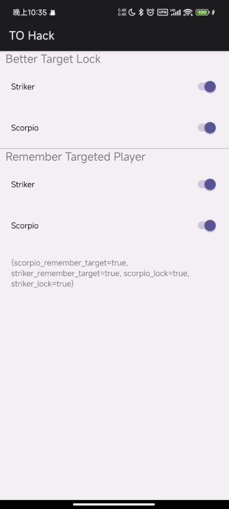

# TO Hack

A Xposed module for old TankiOnline Android client.

## Functions

### Better Target Lock

Aimbot for Striker and Scorpio (target forcing lock)

Note: The server has hack detection, you must **MANUALLY** aim at the target during the aiming charging, or you will only shoot one valid rocket.

### Remember Targeted Player

Once you start aiming someone, your target result won't lose unless you try to aim at another player, and the target mark will keep on your screen so you can track the target.

For Striker, you can track target's location. The server has wall check, if you charging behind a wall, will only shoot one valid rocket.

For Scorpio, you can track target's location and aim your target at anywhere anytime because the server doesn't have wall check for Scorpio aiming.
